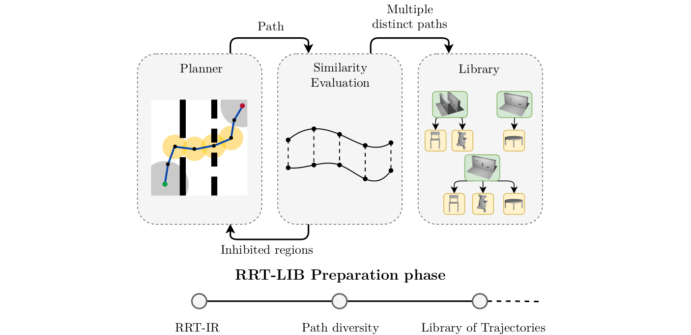
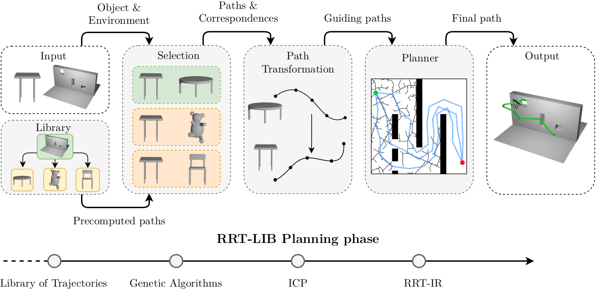
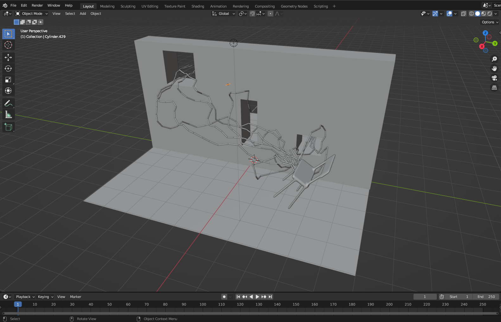
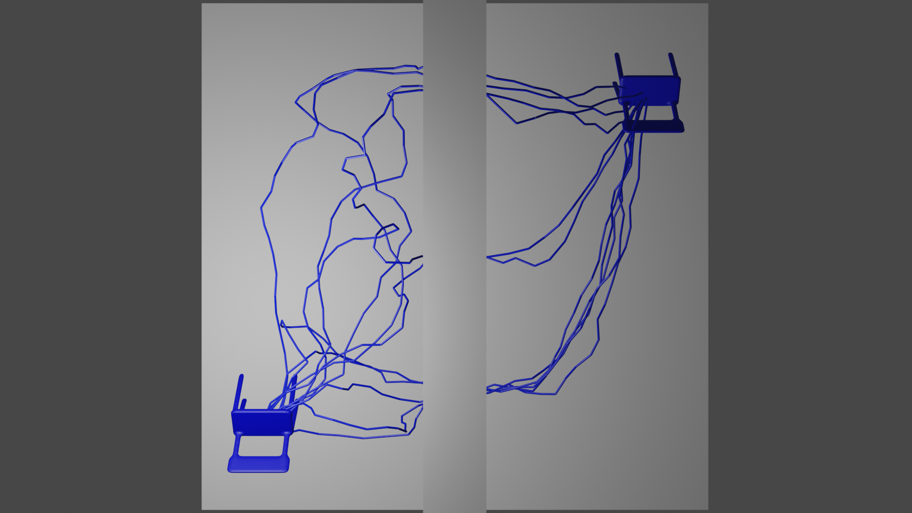
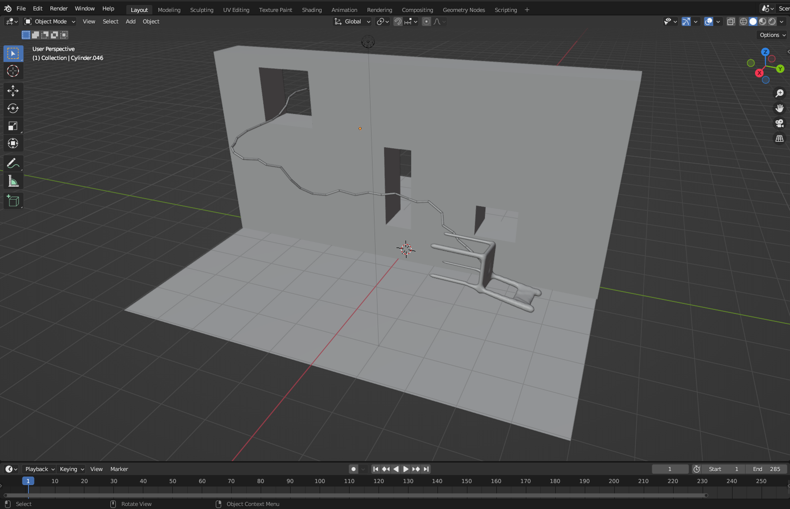

# RRT-LIB

Collection of scripts for testing our novel RRT-LIB algorithm

## Preparation phase


## Planning phase


<div style="page-break-after: always;"></div>

## Structure

Some libraries are included directly in the tracked code for convenience. All rights go to respective authors.

| Folder                       | Contents                                                                                                                            |
| ---------------------------- | ----------------------------------------------------------------------------------------------------------------------------------- |
| `build/`                     | Temporary folder for compiling the app                                                                                              |
| `data/`                      | Object and map meshes                                                                                                               |
| `include/`                   | C++ header files                                                                                                                    |
| `ompl/`                      | Code implementing RRT-LIB within the OMPL library, along with benchmarking scripts                                                  |
| `output/`                    | Logs and outputs of runs                                                                                                            |
| `src/`                       | C++ source code                                                                                                                     |
| `external/`                  | Contains third-party libraries                                                                                                      |
| `external/json/`             | JSON file loading ([github @ dfedefb](https://github.com/nlohmann/json/tree/dfedefb99369dabc86e307ba7edaeb4e9116720d))              |
| `external/libicp/`           | ICP implementation (modified, original from [github @ 5b9784e](https://github.com/symao/libicp))                                    |
| `external/nanoflann/`        | Nearest-neighbors search ([github @ 88d5dc4](https://github.com/jlblancoc/nanoflann/tree/88d5dc44e8edf4317a88fc9a9c2c1dd845564810)) |
| `external/rapid/`            | Collision checking ([gamma.cs.unc.edu - Version 2.01](http://gamma.cs.unc.edu/OBB/))                                                |
| `external/shape-similarity/` | Shape similarity evaluation (modified, link available in the [original paper](https://doi.org/10.1145/3243593))                     |


<div style="page-break-after: always;"></div>

## Installation

### Eigen

Eigen needs to be installed to a location visible to the compiler (e.g., `/usr/local/include/Eigen`) - see the [installation guide](https://eigen.tuxfamily.org/dox/GettingStarted.html) for more.

> On Ubuntu, eigen can be also installed via `apt` 
> ```sh
> sudo apt install libeigen3-dev
> ```
> By default, this installs the headers to `/usr/include/eigen3`. In that case, modify the Makefile  
> ```makefile
> # EIGEN setup
> INCLUDE  += -I/usr/include/eigen3
> ```

### OMPL

The planner is implemented using the [Open Motion Planning Library](https://ompl.kavrakilab.org/).

Download and install OMPL source from [ompl.kavrakilab.org](https://ompl.kavrakilab.org/download.html).
The location is set using `CMAKE_INSTALL_PREFIX`, here it is set to `/home/<user>/opt` (if a different path is used, the Makefile needs to be modified accordingly).

```sh
# Download and prepare the files
wget https://github.com/ompl/ompl/archive/1.5.2.tar.gz
tar -zxvf 1.5.2.tar.gz
rm 1.5.2.tar.gz
cd ompl-1.5.2/
mkdir build
cd build

# Compile
cmake .. -DCMAKE_INSTALL_PREFIX=/home/<user>/opt -DOMPL_VERSIONED_INSTALL=OFF -DOMPL_BUILD_TESTS=OFF -DOMPL_BUILD_DEMOS=OFF -DOMPL_REGISTRATION=OFF

# Install OMPL
make
make install
```

<div style="page-break-after: always;"></div>

If `OMPL_VERSIONED_INSTALL` is set to `ON`, modify the `Makefile` as follows
```makefile
# OMPL setup
LDFLAGS  += -L$(HOME)/opt/lib 
INCLUDE  += -I$(HOME)/opt/include/ompl-1.5
```
### Shape similarity

We use a modified shape similarity evaluation library (original code available in a [paper](https://doi.org/10.1145/3243593) written by Yusuf Sahillioğlu).
It needs to be compiled separately, creating the executable `identify-object` used to identify the guiding object for a given query.

> GCC version 8 and newer is needed due to the usage of C++17 \<filesystem> header.

```sh
cd external/shape-similarity
make identify-object
```

See `external/shape-similarity/README.md` for more info on the usage or call `identify-object -h` after compilation.


### ICP

A modified ICP library is used to find the transformation between the template and the query. Compile the library by

```sh
cd external/libicp/src
make library
```

### RRTLIB

The `Makefile` contains a target `main` that can be built. Two additional targets, `debug` and `release` are available, introducing additional debugging or optimization flags. For convenience (to use relative paths), the header `RRTLIB.h` is copied into the OMPL installation.

```sh
cd paper-rrtlib-code
cp include/RRTLIB.h ~/opt/include/ompl/geometric/planners/rrt/
make release
```

<div style="page-break-after: always;"></div>

## Usage

After a successful installation, an executable `main` will be available. Get the full list of options by calling

```sh
./main -h
```

Three modes are available

- **0**: Generate guiding paths for GUIDING_OBJECT and use them immediately to plan for OBJECT
- **1**: Load guiding paths computed for GUIDING_OBJECT and use them to plan for OBJECT
- **2**: Generate guiding paths for GUIDING_OBJECT and exit

See [Running the examples](#running-the-examples) section for full example.


## Running the examples

### Prepare the library

`examples/create_library.py` will prepare commands that can be called to compute the guiding paths and save them to the library. For a single map (`data/maps/1w3h.off`), paths for three distinct objects are computed. These will serve as guiding paths for the subsequent planning.

The commands can then be executed in parallel using `parallel`

```sh
python3 examples/create_library.py | parallel
```

or sequentially using `xargs` (if `parallel` is not available)

```sh
python3 examples/create_library.py | xargs -L 1 xargs
```

The results can be visualized using Blender (assuming a compatible version of Blender is installed - the scripts were prepared for version **3.4**).

```sh
bash data/library/1w3h/chair112/blender_show.sh
```

<p align="middle">
   
  
</p>


### Run the planning 

After the library is created, run a planning task by

```sh
python3 examples/run_planning.py
```

At first, [shape similarity](#shape-similarity) script is used to determine the most similar library object to the query object and the according guiding ṕaths are retrieved. Then, the planning is executed and the results are saved into `output/example`.

Again, the results can be visualized

```sh
bash output/example/blender_show.sh
```

<p align="middle">
   
  <video width="350" height="200" controls>
    <source src="docs/final_path_render.mp4" type="video/mp4">
  </video>
</p>

## Author

Michal Minařík | <minarmi5@fel.cvut.cz>
